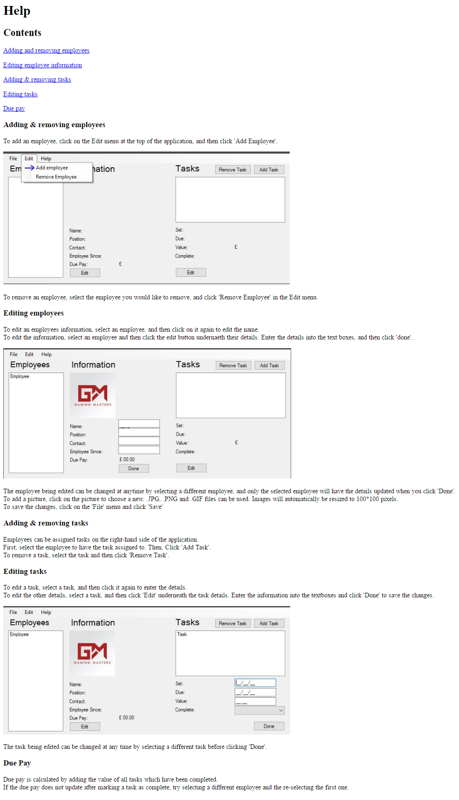

# <p align="center">Appendix</p>

### 1.1: Help feature
This is the help feature the user can reference for help with utilising the program;


This is the code that generates the above page;

```HTM
    <!DOCTYPE html>
    <html>
      <head>
        <title>Page Title</title>
      </head>
      <body>
        <h1>Help</h1>
        <h2>Contents</h2>
        <p><a href="#1">Adding and removing employees</a></p>
        <p><a href="#2">Editing employee information</a></p>
        <p><a href="#3">Adding & removing tasks</a></p>
        <p><a href="#4">Editing tasks</a></p>
        <p><a href="#5">Due pay</a></p>

        <h3 id = 1>Adding & removing employees</h3>
        <p>To add an employee, click on the Edit menu at the top of the application, and then click 'Add Employee'.</p>
        
        <p>To remove an employee, select the employee you would like to remove, and click 'Remove Employee' in the Edit menu.</p>

        <h3 id = 2>Editing employees</h3>
        <p>To edit an employees information, select an employee, and then click on it again to edit the name.<br>To edit the information, select an employee and then click the edit button undernaeth their details. Enter the details into the text boxes, and then click 'done'.<p>
        
        <p>The employee being edited can be changed at anytime by selecting a different employee, and only the selected employee will have the details updated when you click 'Done'.<br>To add a picture, click on the picture to choose a new. .JPG, .PNG and .GIF files can be used. Images will automatically be resized to 100*100 pixels.<br>To save the changes, click on the 'File' menu and click 'Save'</p>

        <h3 id = 3>Adding & removing tasks</h3>
        <p>Employees can be assigned tasks on the right-hand side of the application.<br>First, select the employee to have the task assigned to. Then, Click 'Add Task'.<br>To remove a task, select the task and then click 'Remove Task'.</p>

        <h3 id = 4>Editing tasks</h3>
        <p>To edit a task, select a task, and then click it again to enter the details.<br>To edit the other details, select a task, and then click 'Edit' underneath the task details. Enter the information into the textboxes and click 'Done' to save the changes.</p>
        
        <p>The task being edited can be changed at any time by selecting a different task before clicking 'Done'.</p>

        <h3 id = 5>Due Pay</h3>
        <p>Due pay is calculated by adding the value of all tasks which have been completed.<br>If the due pay does not update after marking a task as complete, try selecting a different employee and the re-selecting the first one.</p>
      </body>
    </html>
```


### 1.2: Relative file paths
A relative file path is used when there is no access to higher directories, only lower ones. Most file paths start at the root directory, e.g, C:/ on windows or / on Linux and Unix.  
As my program is designed to be run on any windows computer in any location, it cannot use the install location to get the file paths of the program resources, such as the help document.
