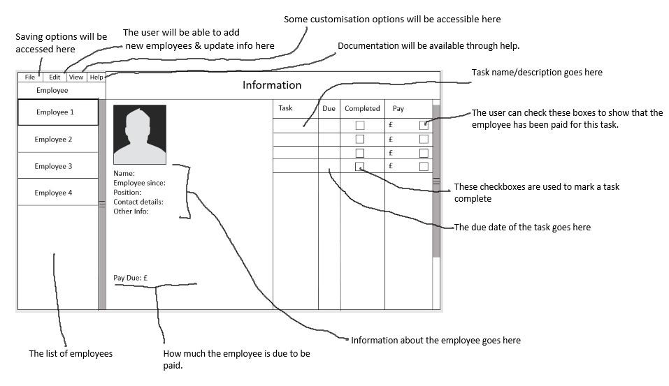

# 
Design

### Setting & completing tasks
The primary purpose of the application is to calculate pay for each employee, so first there must be a way to represent and store information about employees.  
Using OOP (object-orientated programming), each employee could be an instance of a class (created when the user adds a new employee), with tasks as properties of the employee class.  
This solution would require the user to-re-enter all of the employees information and tasks each time, so it would be even less useful than the spreadsheet my client is currently using.  
A better solution would be to create a file to store information about each employee. This could be a simple text file, with the name of each task (and whether or not it is completed) on each line.  
This solution also allows the program to save the data, satisfying two requirements in one.  
Assuming that different tasks have different pay, this will also be saved in the file.  
Each line could have the format of taskName;pay;completed.  
### Calculating pay
The calculation is very simple, number of tasks completed * pay per task.  
There will need to be a setting for the pay per task. As different tasks may be worth different amounts, the pay will be set when the task is created.  
### Saving data
I have already outlined how data for tasks will be saved (in a text file), however it may be necessary to save other data about employees, such as contact details. This could be incorporated into the employees file. A set number of lines can be dedicated to each section (e.g; first 5 lines for employee information, then line 6 onwards for tasks).  
### Exporting data
A huge part of exporting has been solved already - the information will be saved in separate text files. This means exporting is a relatively simple matter of formatting the data for different purposes.   
It would be best to export to .XML, as this format can be used a variety of spreadsheet programs such as Excel, Calc and Google Sheets. Depending on the complexity of this format, more research is needed to determine if this is within the scope of this project. If it is not, then the data could be formatted for easy reading in .txt format.  
### Aesthetics
While I have more experience with making console applications, it would be much easier for the user if I created a windows form application instead. My first draft of the design is below;  
  
On the left, there is a scrollable list of employees. The user can add, remove or edit employees through the ‘Edit’ menu at the top.  
In the middle is a section to show information about the employees. There will also be an option to add a picture, to make it easier to identify which employee is currently selected at a glance.  
On the right is a list of tasks for the currently selected employee. Here, the user can add and remove tasks, as well as editing details such as the description, when it should be completed by, whether or not it has been completed, and how much it is worth.  
#### Making a GUI
By looking at some tutorials for making Windows Forms (which I determined was the easiest way to make a GUI with C#), I have outlined some ideas for how to make GUI;  
##### The employee list  
This could be a ListView, a winform element that can display a list of items. These items can have sub-items, which could be used to store information about the employee, and tasks.  
##### The employee details  
These could be shown using labels, which are basically just text that can be programmatically updated.  
The image could be shown using an imageBox, a winform element for displaying images. It can automatically resize them, so limiting the user to a particular resolution isn’t required. Limiting filetypes for this image might be.
##### The task list
This will probably be another ListView, but it’s contents will be taken from the subitems of the first. It can be programmatically updated whenever an employee is selected.
##### Titles, menus, etc
There is a standard menu element for winforms, and titles can simply be labels.
